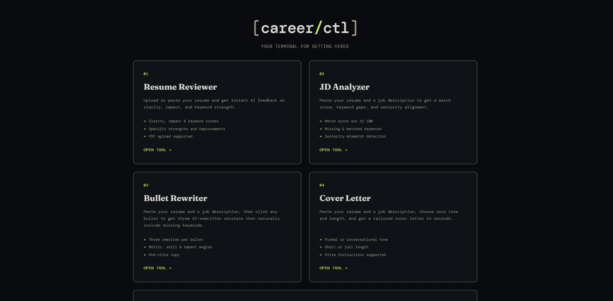

# careerCTL

AI-powered career toolkit built with FastAPI and the Claude API. Five tools to take you from resume to offer.



## Tools

- **Resume Reviewer** — upload or paste your resume and get scores for clarity, impact, and keywords, plus specific strengths and improvements
- **JD Analyzer** — paste your resume and a job description to get a match score, missing keywords, skill gaps, and seniority alignment
- **Bullet Rewriter** — click any resume bullet and get three AI-rewritten versions that naturally incorporate missing keywords
- **Cover Letter Generator** — paste your resume and a job description, choose your tone and length, and get a tailored cover letter in seconds
- **Interview Prep** — paste a job description and get the 5 most likely technical and behavioural interview questions, each with a suggested answer framework and interviewer-intent insight

## How It Works

The frontend is plain HTML, CSS, and JavaScript — no framework. Each tool is a separate page that collects user input and sends it to the FastAPI backend via a POST request.

The backend (`main.py`) receives the request, formats a prompt, and sends it to the Claude API. Claude returns structured JSON which the backend passes straight to the frontend. The JavaScript on each page parses that JSON and renders the results into the UI.

There is no database or user accounts — everything is stateless. Each request is self-contained.

## Setup & Run

**Prerequisites:** Python 3.9+, an [Anthropic API key](https://console.anthropic.com/)

```bash
# 1. Clone the repo
git clone https://github.com/loganmharkness/careerCTL.git
cd careerCTL

# 2. Install dependencies
pip install -r requirements.txt

# 3. Add your API key
echo "ANTHROPIC_API_KEY=your_key_here" > .env

# 4. Start the server
uvicorn main:app --reload

# 5. Open in browser
# http://localhost:8000
```

## Testing

Install dev dependencies:

```bash
pip install -r dev-requirements.txt
```

Run all tests:

```bash
pytest tests/
```

Tests hit the live Claude API and require a valid `ANTHROPIC_API_KEY` in your `.env` file. Each test class covers one endpoint with a happy path, a missing-input error check, and a response format assertion.

## Tech Stack

- **Frontend** — HTML, CSS, JavaScript
- **Backend** — Python, FastAPI
- **AI** — Anthropic Claude API (claude-haiku-4-5)

## Project Structure
```
careerctl/
├── main.py
├── .env
└── static/
    ├── index.html
    ├── style.css
    ├── reviewer.html / reviewer.js
    ├── analyzer.html / analyzer.js
    ├── rewriter.html / rewriter.js
    ├── coverletter.html / coverletter.js
    └── interviewprep.html / interviewprep.js
```

---

Made by Logan Harkness
